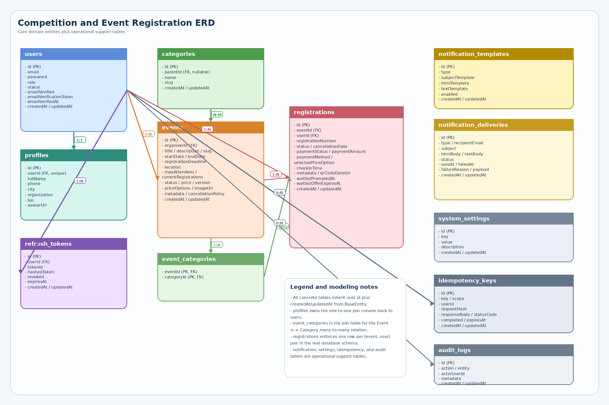

# API Summary

This document maps the currently implemented API surface in the NestJS backend. It is organized in two ways:

- by the order a real user would normally move through the product
- by persona so each role can quickly find the endpoints it can use

## Base conventions

- Default base URL: `http://localhost:3000/api`
- Default auth style: `Authorization: Bearer <accessToken>` on protected routes
- Registration writes require an `Idempotency-Key` header and the backend replays successful duplicates safely
- File uploads use multipart form-data and are served from `/uploads/...`
- Event registration exports return JSON with `fileName` and CSV `content`, not a streamed download

## Recommended journey order

1. Public checks and discovery: `GET /api/health`, `GET /api/health/ready`, `GET /api/categories`, `GET /api/events`, `GET /api/events/:slug`
2. Guest onboarding: `POST /api/auth/register`, `GET /api/auth/verify-email/:token`, `POST /api/auth/login`
3. Participant self-service: `GET /api/auth/me`, `GET/PATCH /api/users/profile`, `PATCH /api/users/password`, `POST /api/users/avatar`
4. Participant event booking: `POST /api/events/:eventId/register`, `GET /api/users/registrations`, `POST /api/registrations/:id/claim`, `DELETE /api/registrations/:id`
5. Organizer operations: `POST /api/events`, `POST /api/events/:id/image`, `PATCH /api/events/:id`, `GET /api/events/:id/registrations`, `POST /api/events/:id/export`, `POST /api/events/:eventId/registrations/:id/check-in`
6. Admin governance: `GET /api/admin/dashboard`, `GET /api/admin/users`, `PATCH /api/admin/users/:id/role`, `PATCH /api/admin/users/:id/status`, `GET /api/admin/registrations`, `PUT /api/admin/settings`, `PATCH /api/admin/notification-templates/:type`, category management routes

## Public and platform APIs

### Health and readiness

| Method | Path | Auth | Request shape | Notes |
| --- | --- | --- | --- | --- |
| GET | `/api/health` | Public | None | Liveness probe that returns service name, uptime, and timestamp. |
| GET | `/api/health/ready` | Public | None | Readiness probe that checks PostgreSQL and Redis. |

### Event discovery

| Method | Path | Auth | Request shape | Notes |
| --- | --- | --- | --- | --- |
| GET | `/api/events` | Public | Query: page, limit, search?, status?, startDateFrom?, startDateTo?, categorySlug?, sortBy?, sortOrder? | Lists events with pagination, filtering, and sorting. Draft events are hidden unless status is explicitly requested. |
| GET | `/api/events/:slug` | Public | Path: slug | Returns detailed event data, organizer profile summary, categories, and registration state flags. |

### Categories

| Method | Path | Auth | Request shape | Notes |
| --- | --- | --- | --- | --- |
| GET | `/api/categories` | Public | None | Returns the category tree used by event filtering and event creation. |

## Guest APIs

A guest discovers the platform, creates an account, verifies email, and logs in before becoming a participant.

### Typical flow

1. Check service health and browse public events/categories.
1. Create a participant account with `POST /api/auth/register`.
1. Verify email with `GET /api/auth/verify-email/:token` unless the account is the very first user in the system.
1. Log in with `POST /api/auth/login` to receive access and refresh tokens.
1. Rotate tokens with `POST /api/auth/refresh` and revoke a session with `POST /api/auth/logout`.

### Authentication

| Method | Path | Auth | Request shape | Notes |
| --- | --- | --- | --- | --- |
| POST | `/api/auth/register` | Public | Body: email, password, fullName, phone?, city?, organization? | Creates the user profile. The first registered user is auto-promoted to admin and auto-verified. |
| POST | `/api/auth/login` | Public | Body: email, password | Protected by LocalAuthGuard and a 5 attempts / 15 minutes throttle profile. |
| POST | `/api/auth/refresh` | Public | Body: refreshToken | Revokes the existing refresh token and issues a brand new access/refresh pair. |
| POST | `/api/auth/logout` | Public | Body: refreshToken | Revokes the provided refresh token. |
| GET | `/api/auth/verify-email/:token` | Public | Path: token | Marks the email as verified and clears the stored verification token. |

## Participant APIs

A participant manages their account, registers for published events, handles waitlist offers, and reviews their event history.

### Typical flow

1. Log in and inspect the current session via `GET /api/auth/me`.
1. Update profile data, avatar, or password from the user endpoints.
1. Review a published event and register with an idempotent request.
1. Monitor registration status, including pending, confirmed, waitlisted, cancelled, or attended.
1. Claim a waitlist offer before it expires or cancel a registration before the event deadline.

### Session and profile

| Method | Path | Auth | Request shape | Notes |
| --- | --- | --- | --- | --- |
| GET | `/api/auth/me` | JWT | None | Returns the authenticated user profile snapshot. |
| GET | `/api/users/profile` | JWT + active account | None | Returns the participant profile object including avatar metadata. |
| PATCH | `/api/users/profile` | JWT + active account | Body: email?, password?, fullName?, phone?, city?, organization? | Email changes reset verification and generate a new verification token. |
| PATCH | `/api/users/password` | JWT + active account | Body: currentPassword, newPassword | Requires the current password to match before hashing the new password. |
| POST | `/api/users/avatar` | JWT + active account | Multipart form-data: file | Accepts jpg/jpeg/png up to 5 MB and stores the public file under `/uploads/avatars`. |
| DELETE | `/api/users/account` | JWT + active account | None | Deletes the account and cascades related owned records defined by the database model. |

### Registrations

| Method | Path | Auth | Request shape | Notes |
| --- | --- | --- | --- | --- |
| POST | `/api/events/:eventId/register` | JWT + active account | Header: Idempotency-Key. Body: selectedPriceOption?, paymentMethod?, metadata? | Creates confirmed, pending, or waitlisted registrations depending on capacity and pricing. |
| GET | `/api/users/registrations` | JWT + active account | None | Lists the caller's registrations ordered by newest first. |
| POST | `/api/registrations/:id/claim` | JWT + active account | Path: registration id | Claims a live waitlist offer and converts it to pending or confirmed based on payment amount. |
| DELETE | `/api/registrations/:id` | JWT + active account | Path: registration id | Cancels the participant's own registration and triggers waitlist promotion when capacity opens up. |

## Organizer APIs

An organizer logs in, creates and publishes events, reviews event registrations, exports CSV data, and checks attendees in on-site.

### Typical flow

1. Log in as an organizer or admin-enabled organizer account.
1. Create an event draft or published event with categories, pricing, and scheduling details.
1. Upload an event image, then update the event as details change.
1. Inspect registrations, export registration CSV data, and check attendees in.
1. Delete the event only if it has no registrations; otherwise use status/cancellation workflows instead.

### Event management

| Method | Path | Auth | Request shape | Notes |
| --- | --- | --- | --- | --- |
| POST | `/api/events` | JWT + active account + organizer/admin role | Body: title, description, startDate, endDate, registrationDeadline, location, maxAttendees?, status?, price?, priceOptions?, categoryIds?, metadata?, cancellationPolicy? | Creates the event, validates date ordering, generates a unique slug, and stores category links. |
| POST | `/api/events/:id/image` | JWT + active account + organizer/admin role | Multipart form-data: file | Accepts jpg/jpeg/png up to 8 MB and publishes the asset under `/uploads/events`. |
| PATCH | `/api/events/:id` | JWT + active account + organizer/admin role | Body: any subset of the create-event fields | Ownership is enforced for organizers. Non-draft updates notify registered participants. |
| DELETE | `/api/events/:id` | JWT + active account + organizer/admin role | Path: event id | Deletion is blocked when registrations already exist. |

### Operations and exports

| Method | Path | Auth | Request shape | Notes |
| --- | --- | --- | --- | --- |
| GET | `/api/events/:id/registrations` | JWT + active account + organizer/admin role | Path: event id | Lists all registrations for an event after organizer ownership is validated. |
| POST | `/api/events/:id/export` | JWT + active account + organizer/admin role | Path: event id | Returns `{ fileName, content }` where `content` is CSV text, not a streamed file response. |
| POST | `/api/events/:eventId/registrations/:id/check-in` | JWT + active account + organizer/admin role | Path: eventId, registration id | Checks in confirmed registrations only. Authorization uses the registration's linked event organizer. |

## Admin APIs

An admin oversees platform analytics, user governance, registrations, system settings, categories, and notification templates.

### Typical flow

1. Log in with an admin account and load the dashboard summary.
1. Search users, assign roles, and suspend or reactivate accounts.
1. Inspect all registrations or export an event's full registration CSV.
1. Manage system settings, category taxonomy, and notification templates.

### Dashboard and user administration

| Method | Path | Auth | Request shape | Notes |
| --- | --- | --- | --- | --- |
| GET | `/api/admin/dashboard` | JWT + active account + admin role | None | Returns totals, charts, recent registrations, and recent audit activity. |
| GET | `/api/admin/users` | JWT + active account + admin role | Query: page, limit, search?, email?, role?, status? | Returns paginated user data with optional email and role filters. |
| PATCH | `/api/admin/users/:id/role` | JWT + active account + admin role | Body: role | Prevents demoting the last remaining admin account. |
| PATCH | `/api/admin/users/:id/status` | JWT + active account + admin role | Body: status | Toggles user status between `active` and `suspended`. |

### Registrations and exports

| Method | Path | Auth | Request shape | Notes |
| --- | --- | --- | --- | --- |
| GET | `/api/admin/registrations` | JWT + active account + admin role | Query: page, limit, search?, status?, paymentStatus?, eventId? | Searches across registration number, user email, and event title. |
| POST | `/api/admin/events/:id/export` | JWT + active account + admin role | Path: event id | Exports an event's registration rows as a JSON wrapper containing CSV text. |

### Settings, categories, and templates

| Method | Path | Auth | Request shape | Notes |
| --- | --- | --- | --- | --- |
| GET | `/api/admin/settings` | JWT + active account + admin role | None | Returns all stored system settings. |
| PUT | `/api/admin/settings` | JWT + active account + admin role | Body: items[{ key, value, description? }] | Upserts system settings in batch form. |
| GET | `/api/admin/notification-templates` | JWT + active account + admin role | None | Lists all notification templates keyed by notification type. |
| PATCH | `/api/admin/notification-templates/:type` | JWT + active account + admin role | Body: subjectTemplate?, htmlTemplate?, textTemplate?, enabled? | Updates one notification template at a time. |
| POST | `/api/categories` | JWT + admin role | Body: name, parentId? | Creates a new category node for the public category tree. |
| PATCH | `/api/categories/:id` | JWT + admin role | Body: name?, parentId? | Updates category naming or hierarchy. |
| DELETE | `/api/categories/:id` | JWT + admin role | Path: category id | Deletes the chosen category. |

## Workflow notes

- First user bootstrap: the very first registered user becomes `admin`, is immediately email-verified, and can use admin routes without a separate role-assignment step.
- Email verification: non-admin users must verify email before login succeeds.
- Registration outcomes: free registrations become `confirmed`, paid registrations become `pending`, and full events create `waitlisted` registrations.
- Waitlist handling: cancelled seats trigger waitlist promotion; claimed offers expire after 24 hours if not accepted.
- Check-in rule: only organizers who own the event, or admins, can check in attendees, and only `confirmed` registrations can be checked in.
- Health readiness: `/api/health/ready` checks both the database and Redis dependencies before reporting success.

## Artifacts generated with this summary

- Postman collection: `docs/postman/event-registration-api.postman_collection.json`
- Eraser diagram-as-code: `docs/erd/event-registration.eraser`
- ERD image: `images/event-registration-erd.png`

## ERD preview

